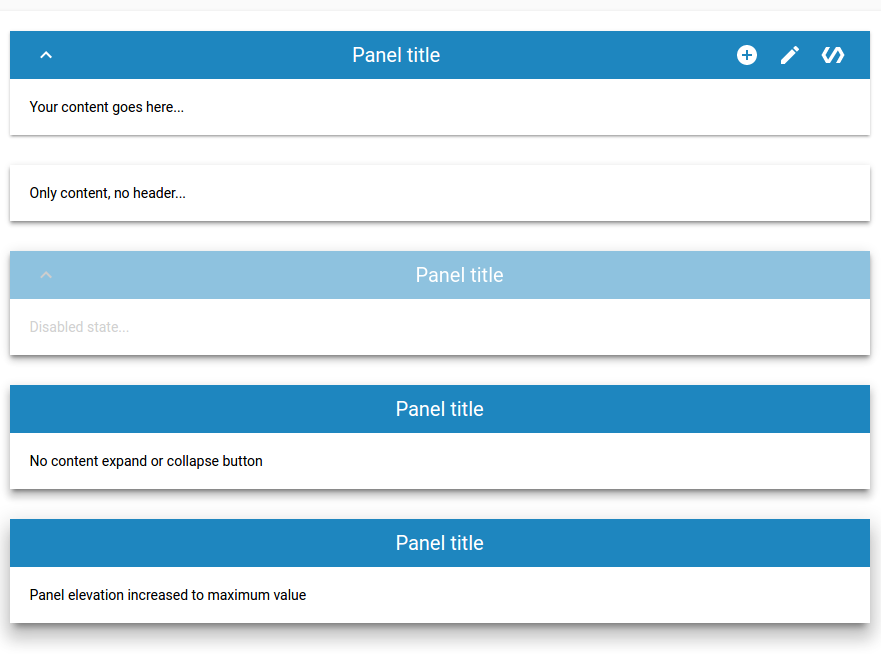

# \<etools-content-panel\>

A simple panel with header to display a collapsible content.



## Usage
```html
<etools-content-panel title="Panel title" show-expand-btn>
  <div>Your content goes here...</div>
</etools-content-panel>

<etools-content-panel title="Panel title" no-header elevation="2">
  <div>Only content, no header...</div>
</etools-content-panel>

<etools-content-panel title="Panel title" elevation="3" is-disabled="true" show-expand-btn>
  <div>Disabled state...</div>
</etools-content-panel>

<etools-content-panel title="Panel title" elevation="4">
  <div>No content expand or collapse button</div>
</etools-content-panel>

<etools-content-panel title="Panel title" title-style="align-center" elevation="5">
  <div>Panel elevation increased to maximum value</div>
</etools-content-panel>
```

Attributes:
* elevation - Number Default: 1
* isDisabled - Boolean, Default: false
* noHeader - Boolean, Default: false
* open - Boolean, Default: true - notifies
* showExpandBtn - Boolean, Default: false
* title - String, Default: Panel title

All attributes of the element are not required.


## Styling

You can use defined variables and mixins to change panel style.

Custom property | Description | Default
----------------|-------------|----------
`--ecp-header-height` | Header height | `48px`
`--ecp-header-bg` | Header background color | `#1e86bf`
`--ecp-header-title` | Mixin applied to the header title | `{}`
`--ecp-expand-btn` | Mixin applied to expand content utton | `{}`
`--ecp-header-disabled` | Mixin applied to header when it's disabled | `{}`
`--ecp-content` | Mixin applied to content | `{}`
`--ecp-disabled-color` | Content disabled color | `#d1d1d1`


## Install
```bash
$ bower install --save etools-content-panel
```

## Preview element locally

Install needed dependencies by running: `$ bower install`.
Make sure you have the [Polymer CLI](https://www.npmjs.com/package/polymer-cli) installed. Then run `$ polymer serve` to serve your element application locally.

## Running Tests

You need to have `web-component-tester` installed (if not run `npm install -g web-component-tester`)
```bash
$ wtc
```
or 
```bash
$ wtc -p
```
